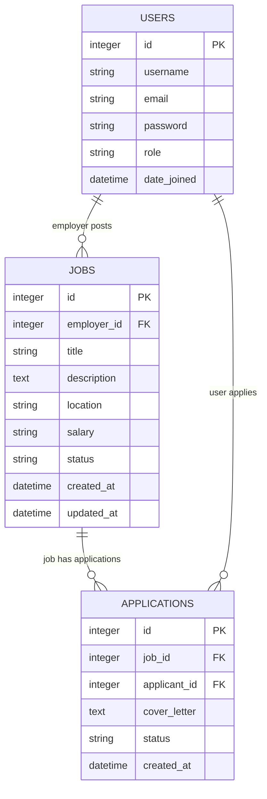

# ERD (Draft) — Job Board Backend

## Mermaid ER Diagram (draft)

---

## Models & Key Fields

- **User** (custom AbstractUser)
  - id, username, email, password, role (ADMIN / EMPLOYER / JOBSEEKER), plus built-in fields

- **Job**
  - id, employer (FK -> User), title, description, location, salary, status (DRAFT/OPEN/CLOSED), created_at, updated_at

- **Application**
  - id, job (FK -> Job), applicant (FK -> User), cover_letter, status (PENDING/REVIEWED/ACCEPTED/REJECTED), created_at
  - Unique constraint: (job, applicant) — a user can apply only once per job

---

## Relationships

- User (1) -> Job (M): a user with role EMPLOYER posts many jobs
- Job (1) -> Application (M): a job receives many applications
- User (1) -> Application (M): a user (applicant) can submit many applications

---

## Indexing & Optimization Suggestions

- Add an index on `Job.status` (for fast filtering by OPEN/CLOSED)
- Add composite indexes for commonly filtered fields (e.g., `location`, `status`, `created_at`)
- Consider full-text search index on `Job.title` and `Job.description` for efficient search

---

## Future Model Additions (recommended)

- **Category** model (industry, type) and `ManyToMany` with `Job` or ForeignKey if single category
- **Company / EmployerProfile** model for richer employer data (company name, website)
- **JobTag** for tag-based search
- **Audit / Activity** logs for admin visibility

---

## Next Steps

- Review diagram and confirm fields/relationships
- Optionally generate a visual PNG/SVG from the Mermaid diagram (for README or slide deck)
- Add ERD to the presentation deck (Google Slides)

---

Generated from models in `users.models`, `jobs.models`, and `applications.models` (backend project).  
Feel free to request a PNG/SVG export or adjustments to include additional fields (categories, company profile, etc.).
